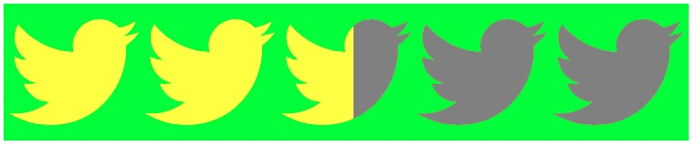

# AJScoreView
自定义评分控件，支持星型、心型以及自定义的UIBezierPath形状，可以自定义各种属性，支持storyboard设置和编辑事件。

### 截图


### 安装(Install)

#### CocoaPods支持

在Podfile增加AJScoreView库

```ruby
source 'https://github.com/CocoaPods/Specs.git'
platform :ios, '8.0'

target 'TargetName' do
    pod 'AJScoreView'
end
```

然后Podfile文件的目录运行命令安装:

```ruby
pod install
```
Enjoy it!

### 使用示例

```objective-c
    scoreView= [[AJScoreView alloc] initWithFrame:CGRectMake(5, 40,250,50)];
    scoreView.backgroundColor = [UIColor greenColor];
    scoreView.enabled = YES;
    [scoreView addTarget:self action:@selector(valueChaneged) forControlEvents:UIControlEventValueChanged];
    [self.view addSubview:scoreView];
```

使用自定义UIBezierPath形状

```objective-c
scoreView.type = AJScoreViewCustomType;
scoreView.path = [self twitterPath];

- (UIBezierPath *)twitterPath{
    
    UIBezierPath* path3611Path = [UIBezierPath bezierPath];
    [path3611Path moveToPoint: CGPointMake(93.72, 242.19)];
    [path3611Path addCurveToPoint: CGPointMake(267.68, 68.23) controlPoint1: CGPointMake(206.18, 242.19) controlPoint2: CGPointMake(267.68, 149.02)];
    [path3611Path addCurveToPoint: CGPointMake(267.5, 60.33) controlPoint1: CGPointMake(267.68, 65.58) controlPoint2: CGPointMake(267.62, 62.95)];
    [path3611Path addCurveToPoint: CGPointMake(298, 28.67) controlPoint1: CGPointMake(279.44, 51.7) controlPoint2: CGPointMake(289.82, 40.93)];
    [path3611Path addCurveToPoint: CGPointMake(262.89, 38.29) controlPoint1: CGPointMake(287.05, 33.54) controlPoint2: CGPointMake(275.26, 36.82)];
    [path3611Path addCurveToPoint: CGPointMake(289.78, 4.48) controlPoint1: CGPointMake(275.51, 30.72) controlPoint2: CGPointMake(285.2, 18.75)];
    [path3611Path addCurveToPoint: CGPointMake(250.95, 19.32) controlPoint1: CGPointMake(277.96, 11.48) controlPoint2: CGPointMake(264.88, 16.57)];
    [path3611Path addCurveToPoint: CGPointMake(206.32, 0) controlPoint1: CGPointMake(239.79, 7.43) controlPoint2: CGPointMake(223.91, 0)];
    [path3611Path addCurveToPoint: CGPointMake(145.18, 61.13) controlPoint1: CGPointMake(172.56, 0) controlPoint2: CGPointMake(145.18, 27.38)];
    [path3611Path addCurveToPoint: CGPointMake(146.76, 75.07) controlPoint1: CGPointMake(145.18, 65.93) controlPoint2: CGPointMake(145.71, 70.6)];
    [path3611Path addCurveToPoint: CGPointMake(20.74, 11.19) controlPoint1: CGPointMake(95.95, 72.52) controlPoint2: CGPointMake(50.89, 48.19)];
    [path3611Path addCurveToPoint: CGPointMake(12.46, 41.92) controlPoint1: CGPointMake(15.49, 20.23) controlPoint2: CGPointMake(12.46, 30.72)];
    [path3611Path addCurveToPoint: CGPointMake(39.67, 92.82) controlPoint1: CGPointMake(12.46, 63.13) controlPoint2: CGPointMake(23.25, 81.86)];
    [path3611Path addCurveToPoint: CGPointMake(11.98, 85.17) controlPoint1: CGPointMake(29.64, 92.51) controlPoint2: CGPointMake(20.21, 89.75)];
    [path3611Path addCurveToPoint: CGPointMake(11.97, 85.95) controlPoint1: CGPointMake(11.97, 85.43) controlPoint2: CGPointMake(11.97, 85.68)];
    [path3611Path addCurveToPoint: CGPointMake(61.02, 145.88) controlPoint1: CGPointMake(11.97, 115.56) controlPoint2: CGPointMake(33.04, 140.28)];
    [path3611Path addCurveToPoint: CGPointMake(44.9, 148.04) controlPoint1: CGPointMake(55.88, 147.28) controlPoint2: CGPointMake(50.48, 148.04)];
    [path3611Path addCurveToPoint: CGPointMake(33.41, 146.93) controlPoint1: CGPointMake(40.96, 148.04) controlPoint2: CGPointMake(37.13, 147.65)];
    [path3611Path addCurveToPoint: CGPointMake(90.52, 189.4) controlPoint1: CGPointMake(41.19, 171.23) controlPoint2: CGPointMake(63.76, 188.9)];
    [path3611Path addCurveToPoint: CGPointMake(14.58, 215.57) controlPoint1: CGPointMake(69.6, 205.8) controlPoint2: CGPointMake(43.23, 215.57)];
    [path3611Path addCurveToPoint: CGPointMake(-0, 214.72) controlPoint1: CGPointMake(9.66, 215.57) controlPoint2: CGPointMake(4.79, 215.29)];
    [path3611Path addCurveToPoint: CGPointMake(93.72, 242.19) controlPoint1: CGPointMake(27.06, 232.07) controlPoint2: CGPointMake(59.19, 242.19)];
    path3611Path.miterLimit = 4;
    
    return path3611Path;
}

```

### 参数说明

- type

评分控件的形状类型，默认为AJScoreViewStarType星型

> AJScoreViewStarType， 星型
> AJScoreViewHeartType， 心型
> AJScoreViewCustomType， 自定义UIBezierPath类型

- alignment

评分控件的对齐方式，默认为AJScoreViewAlignmentLeft居左对齐

> AJScoreViewAlignmentCenter， 居中对齐，此时控件会平均对齐，padding间隙会失效
> AJScoreViewAlignmentLeft， 左对齐， 往右边滑动为增加
> AJScoreViewAlignmentRight， 右对齐，往左边滑动为增加

- insert

评分控件绘图区域的上下左右的间距，默认为（2,2,2,2）

- padding

各个形状之间的间隙，必须大于0.1，默认为2.0。如果对齐方式为AJScoreViewAlignmentCenter，则此设置无效

- minimumValue

评分控件的开始的最小值，minimumValue的值不能大于maximumValue，默认为0.0

- maximumValue

评分控件的结束后的最大值，maximumValue的值不能小于minimumValue，默认为5.0

- number

评分控件的显示个数，number必须大于1，默认为5个

- value

评分控件当前的值，编辑选择或者赋予的值

- selectedFillColor

选择部分填充的颜色，默认为黄色

- unselectedFillColor

未选择部分填充的颜色，默认为灰色
- selectedBorderColor

选择部分的边框颜色

- unselectedBorderColor

未选择部分的边框颜色

- borderWidth

边框的宽度

- path

当类型为AJScoreViewCustomType类型的时候，可以通过path赋予不同的形状，如果是星星或心型则使用自带的path。并且只有先赋值type为AJScoreViewCustomType才能赋值path，否则赋值无效。建议使用PaintCode来画图生成Object-C代码。

### 文章说明
[如何开发一个评分控件(一)](http://www.jianshu.com/p/ea74c10a03c2)

[如何开发一个评分控件(二)](http://www.jianshu.com/p/58489bd07e78)


